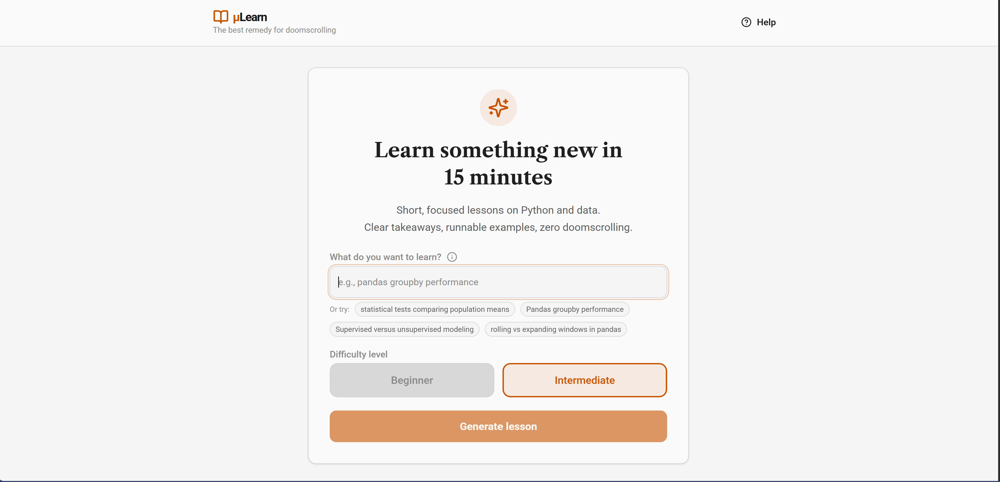
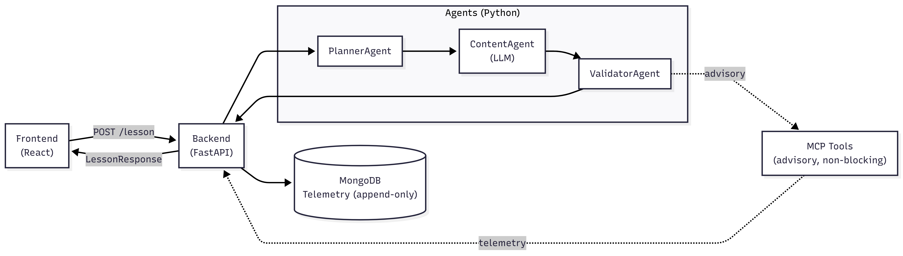

# uLearn — Agentic Micro-Learning Platform

[](https://github.com/dosorio79/ulearn-platform/actions/workflows/ci.yml)
[](#)
[](#)

Focused 15-minute lessons on demand, generated by a multi-agent backend and rendered for a calm, fast learning flow.

  
Screenshot: lesson generation UI.

---

## Problem statement

Short, focused learning sessions are effective—but difficult to sustain.

When learning with AI chatbots, it is easy to drift: a 15-minute goal quickly turns into hours of back-and-forth exploration, topic hopping, and unstructured notes. The result is cognitive overload rather than retention.

At the same time, many practitioners want something they can keep: a small, well-scoped artifact they can revisit, extend, or study offline, instead of a transient chat history.

uLearn addresses this by enforcing intentional micro-learning:
- a strict 15-minute scope,
- a clear pedagogical structure,
- and exportable outputs (Markdown and Jupyter notebooks) that encourage independent follow-up.

The goal is not to replace deep learning or long courses, but to provide a calm, focused alternative to “doom-scroll learning” when time and attention are limited.

---

## What the system does

The system:

- Accepts a topic and difficulty level from the user
- Uses multiple AI agents to:
  - Plan a pedagogically scoped lesson
  - Generate structured content blocks
  - Validate lesson structure and time constraints
- Renders structured blocks into Markdown for the frontend
- Logs each lesson generation run for telemetry purposes

The system is stateless from a user perspective; persistence is limited to append-only telemetry logging.

MCP is used as an internal advisory tooling boundary for post-generation checks. After lesson generation, MCP tools may run non-blocking Python code checks (for example syntax or best-practice hints). These signals do not affect validation or output and are logged to telemetry only.

Context7 support is optional and best-effort. Based on telemetry so far, short, tightly scoped lessons have not consistently benefited from external documentation signals, so MCP checks remain advisory rather than authoritative. Details are documented in `docs/mcp.md`.

---

## High-level architecture

Frontend (React)  
→ POST /lesson  
→ FastAPI Backend  
  - Agent orchestration  
  - OpenAPI contract  
  - Telemetry backend  
→ MongoDB or in-memory  

This separation allows the system to run fully in demo mode without external dependencies.

### Architecture diagram

  
Diagram: end-to-end architecture and data flow.

---

## Agent-based workflow

Lesson generation is implemented using multiple cooperating agents:

- PlannerAgent – defines lesson structure and time budget
- ContentAgentLLM – primary LLM-backed content generator
- ContentAgent – stub fallback generator (optional)
- ValidatorAgent – enforces structure (required sections, block formatting) and normalizes section minutes to a 15-minute total

Only the content generation step uses an LLM; planning and validation are deterministic and fully testable.

Prompt sources for the LLM content agent:
- System prompt: `app/agents/prompts/content_llm_system.txt`
- User prompt template: `app/agents/prompts/content_llm_user.txt`

See `docs/prompts.md` for editing guidance.

### Validation philosophy

Validation is intentionally strict to guarantee:
- Predictable lesson structure
- Executable Python code blocks
- Stable frontend rendering

Frontend UX includes:
- Per-section copy buttons
- Full-lesson Markdown and Jupyter notebook export
- Feedback prompt and improved loading and error states

Detailed agent responsibilities are documented in `docs/agent-architecture.md`.  
Lesson format proof-of-concept and validator rules are summarized in `docs/lesson-generation-poc.md`.  
AI-assisted development constraints are defined in `AGENTS.md`.

---

## V1 goals (planned)

The V1 focus is on tool-augmented validation and learning-quality telemetry:

- MCP-backed content validation (tools provide advisory signals)
- Explicit content contracts (schema plus semantic constraints)
- First-class telemetry for learning quality, not just errors
- Deterministic lesson rebuilds for testing and review
- Clear agent boundaries (planner, content, validator, MCP tools)

See `docs/v1-goals.md` for full details and near-term steps.

---

## Frontend code execution

The frontend can execute Python snippets in lessons using Pyodide (running in the browser).

- Python code blocks include a Run button and display stdout output
- If a snippet does not produce output, the UI prompts the learner to add `print(...)`
- Python blocks are read-only by default; use Edit for quick fixes during exploration and Reset to restore the original generated snippet
- Exports always use the original generated lesson content

You can override the Pyodide base URL with `VITE_PYODIDE_BASE` (defaults to the jsDelivr CDN).

---

## Telemetry and persistence

Each lesson generation run is logged, including:
- Session identifier
- Request parameters
- Output summary (objective, total minutes, section IDs)
- Attempt count (number of generation attempts needed)
- Timestamp

Failure cases (schema validation, content validation, unexpected exceptions) are recorded separately for post-mortem analysis.

This telemetry-first design mirrors authenticated usage patterns and allows a future transition to authenticated sessions without schema changes.

### Database design notes

The database layer is intentionally scoped to telemetry only.

Telemetry is append-only, non-blocking, and does not store user state or lesson content. Two backends are supported:
- MongoDB for local development and inspection
- In-memory storage for demo deployments and tests

Both backends share the same logical event structure, allowing the system to run in environments with or without external dependencies. This design prioritizes reproducibility, demo reliability, and a clear separation between learning logic and persistence concerns.


---

## Technologies used

- Frontend: React
- Backend: FastAPI (Python 3.12)
- AI: Large Language Models orchestrated via `pydantic-ai`
- Database: MongoDB (optional)
- API specification: OpenAPI 3.0
- Containerization: Docker, docker-compose
- Dependency management: uv

---

## Running the project locally

### Requirements

- Docker and docker-compose
- Python 3.12 or newer
- uv
- Node.js 18 or newer

### Quickstart

```bash
make build
```

Then open:
- http://localhost:8080 — Frontend UI  
- http://localhost:8000/docs — API documentation

### Start manually

```bash
docker compose up --build
```

This starts the backend, MongoDB, and the frontend container.

The frontend is built inside the Docker image, so a single `docker compose up --build` is enough to build and run the full stack. `HELP.md` is bundled into the frontend image from the repo root (single source of truth).

To call the backend directly, set:

```
API_BASE=http://localhost:8000
```

---

## Configuration

Create your environment file from `.env-example` and update values as needed:

- `OPENAI_API_KEY` – required when `USE_LLM_CONTENT=true`
- `MODEL` – LLM model name (default: `gpt-4.1-mini`)
- `USE_LLM_CONTENT` – toggle LLM-backed content generation
- `CONTEXT7_API_KEY` – optional; enables best-effort Context7 advisory docs hints
- `CORS_ORIGINS` – allowed origins (default: `http://localhost:8080`)
- `MONGO_FAILURE_COLLECTION` – MongoDB collection for failure telemetry
- `STATIC_LESSON_MODE` – serve static lesson templates
- `TELEMETRY_BACKEND` – `mongo` or `memory`
- `DEMO_MODE` – shorthand for static lessons plus memory telemetry
- `TELEMETRY_MEMORY_CAP` – max in-memory telemetry entries
- `TELEMETRY_INCLUDE_HINT_DETAILS` – include rule/runtime hint payloads in telemetry (counts are always stored)
- `RUNTIME_SMOKE_TEST_ENABLED` – enable advisory runtime smoke checks for Python blocks (restricted builtins, non-blocking)
- `RUNTIME_SMOKE_TEST_TIMEOUT_SECONDS` – timeout for smoke execution (seconds)

---

## Deployment (Render demo)

This repository includes a Render Blueprint-based deployment designed for continuous deployment of a self-contained demo, without external dependencies (LLM APIs or MongoDB).

Live demo (auto-deploys from main):  
https://ulearn-frontend.onrender.com/

What is deployed:
- Backend (FastAPI) running in demo mode (`STATIC_LESSON_MODE=true`, `TELEMETRY_BACKEND=memory`)
- Frontend static React build served via Render

What is not deployed (by design):
- LLM-backed content generation
- MongoDB persistence
- Authenticated user flows

Deploying on Render:
1. Create a new Render Blueprint from `render.yaml`
2. Deploy the backend service first and copy its public URL
3. Set `API_BASE=<backend-url>` in `render.yaml`
4. Deploy the frontend service

Local demo parity:
- cp .env.render .env
- docker compose up --build

---

## Testing

Tests cover:
- Agent planning and validation logic
- Lesson orchestration
- API contract and integration workflow

Run all tests:
- uv run pytest

For CI/local overrides, load `.env` first and then `.env.test` to apply test-only settings.
For Render demo deployments, `.env.render` is a minimal standalone set of defaults and is not layered on `.env`.

For reproducible local runs:
- uv sync --extra dev --frozen

Run integration tests only:
- uv run pytest -m integration

Integration tests live in `tests/integration/` and focus on end-to-end workflows.

Frontend tests:
- cd frontend
- npm test

Frontend API and test coverage:
- Centralized API client: `frontend/src/api/lessonClient.ts`
- Tests cover lesson rendering, API client usage, run/stop flow, and export behavior

---

## CI

GitHub Actions runs backend tests (with a MongoDB service) and frontend lint, test, and build on every push and pull request.  
Merges to `main` are expected to be protected by required CI status checks, which gate the demo deployment. Continuous deployment is handled via the Render Blueprint demo, which auto-deploys from `main`.

---

## Docs index

- `docs/mcp.md` — MCP tooling overview and Context7 behavior
- `docs/testing.md` — Test suites, markers, and local workflows
- `docs/deployment.md` — Deployment and Render demo notes
- `docs/agent-architecture.md` — Agent responsibilities and orchestration flow

---

## Non-goals (by design)

- User authentication
- Long-term user profiles
- Adaptive curricula
- RAG or document ingestion
- Production-grade content evaluation

---

## Future work

- Authentication and user accounts
- Lesson personalization
- Automated exercise evaluation
- Learning analytics and feedback loops

---

## Changelog

See `CHANGELOG.md` for release notes.

---

## Repository history note

This repository was extracted from a larger monorepo used during the AI Dev Tools Zoomcamp course.  
Git history prior to version v0.3.0 does not reflect the original course repository.  
Commits from v0.3.0 onward represent the standalone evolution of this project.
